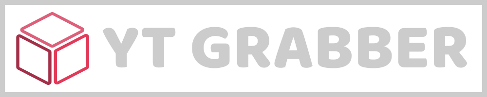
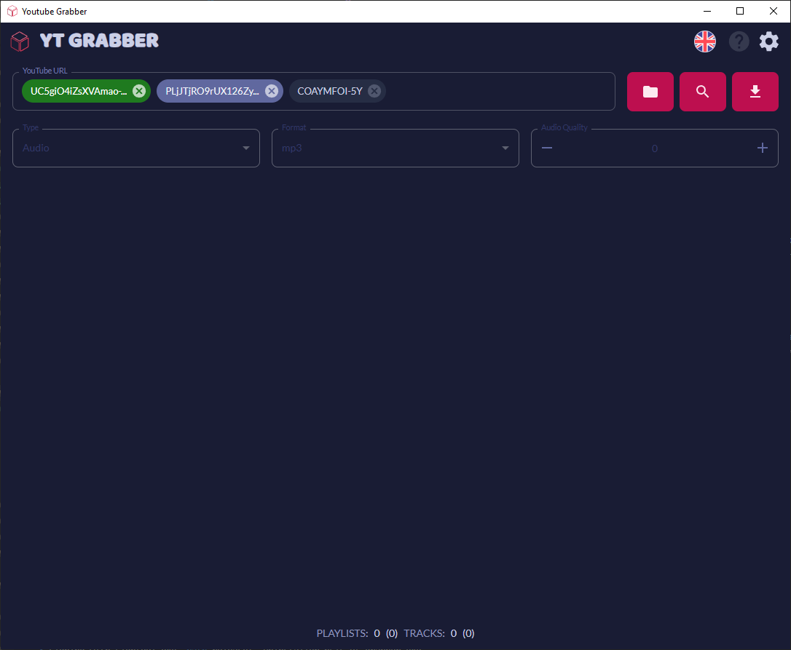
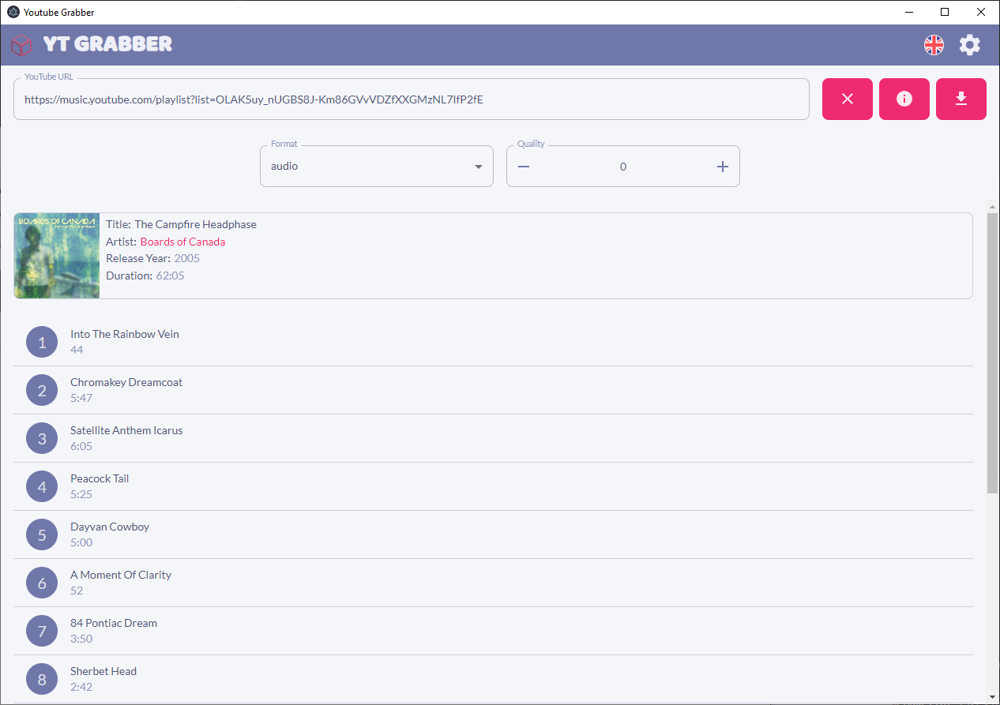
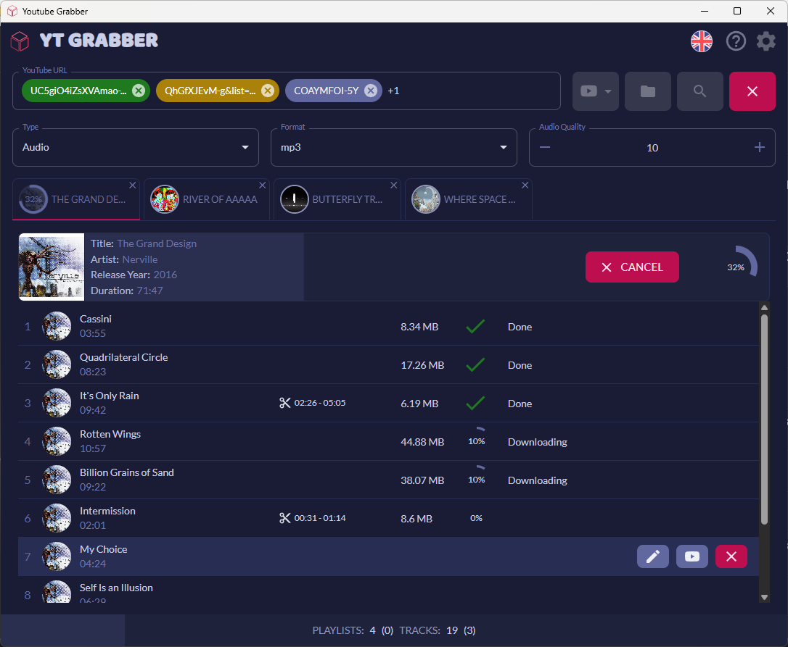
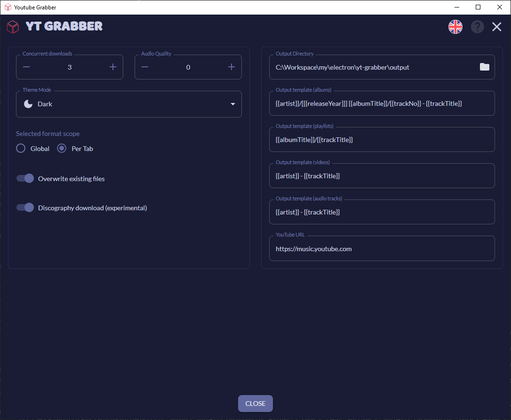
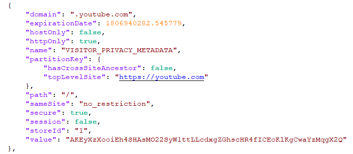
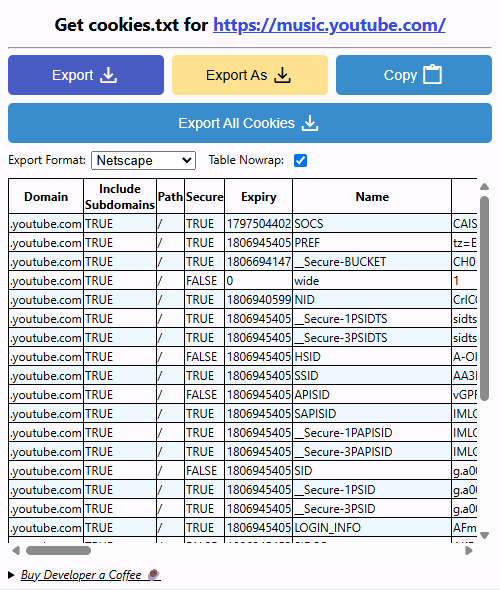

---

**YT Grabber** is a robust desktop application designed to retrieve multimedia from YouTube, YouTube Music and other multimedia sites and social media platforms.

It provides responsive UI to manage your downloads and automation features that improve and accelerate download process.

It provides support for downloading:

-   videos
-   audio tracks
-   playlists
-   music albums
-   full discographies

Various formats and quality options are available for both - audio and video.

Each download can be customized to your needs for easy workflow automation.

## Table of Contents

- [Table of Contents](#table-of-contents)
- [Features](#features)
- [Screenshots](#screenshots)
- [Usage](#usage)
- [Development](#development)
- [Configuring Cookies](#configuring-cookies)
- [Running](#running)
- [Packaging](#packaging)
- [Testing](#testing)
- [Debugging](#debugging)
- [License](#license)
- [Legal Disclaimer](#legal-disclaimer)
- [Support Disclaimer](#support-disclaimer)

## Features
* Support for most major multimedia sites and social media platforms like Youtube, Youtube Music, Vimeo, DailyMotion, Facebook, Instagram, TikTok (full list is available [here](https://github.com/yt-dlp/yt-dlp/blob/master/supportedsites.md))

* Download video, audio, playlists, songs, albums, singles and complete artist discographies

* Multiple output formats (mp3, m4a, flac, wav, mp4, mkv, mov, avi, mpeg, gif)

* Customizable audio and video quality

* Cutting video and audio (multiple output parts)

* Batch multimedia download

* Autodetecting download type

* Metadata (tags) embedding

* Filterable artist discography downloads by release type (album, single, ep) or release year

* Generating animated GIF's from videos (with embedding customizable top and/or bottom text)

* Configurable output

* Multiple language support (English, German, Polish out of the box)

* Light/Dark theme

* Responsive and clean UI

## Screenshots

*Main window*

*Displaying multimedia info*

*Downloading multimedia*

*Settings*

## Usage

Download and run latest release installer from [here](https://github.com/karenpommeroy/yt-grabber/releases).

## Development

To build **yt-grabber** follow these steps:

1. Clone this repository
2. Install dependencies using `npm install` or `yarn install` command
3. If using `yarn` with Visual Studio Code also run `yarn dlx @yarnpkg/sdks vscode`
4. Run `npm build` or `yarn build` command to create development build
5. Run `npm build:prod` or `yarn build:prod` command to create production build.

## Configuring Cookies

> [!CAUTION]
> Cookies include your credentials to websites and services.
> Anyone who sees them can access your account.
> 
> **YT Grabber** uses them only locally when downloading data from websites and services.
> 
> You may use the application without providing any cookies however in that case be aware that you can experience issues with downloading some media.

In order to avoid `yt-dlp` errors and bypass limitations when downloading media you should extract your own cookies and provide it to **YT Grabber**.

To extract cookies from your browser you can use browser extension like [Get cookies.txt LOCALLY](https://chromewebstore.google.com/detail/get-cookiestxt-locally/cclelndahbckbenkjhflpdbgdldlbecc).

To ensure cookies are properly exported follow these steps:
1.  Open browser in incognito/private mode
2.  Go to website from which you want to download media *(ie. music.youtube.com)*
3.  Sign in with your credentials (reload page if needed)
4.  Open **Get cookies.txt LOCALLY** extension and:
    * export cookies in Netscape format and save them as `cookies.txt`
    * export cookies in JSON format and save them as `cookies.json`
    * open exported `cookies.json` file and remove all cokies that have nested properties (they can cause parsing issues)
    
    *Example of invalid JSON cookie*

> [!NOTE]
> Exported cookies should be placed in `APP_INSTALL_DIRECTORY\resources\profile` directory.

*Exporting cookies using `Get cookies.txt LOCALLY` extension*

## Running

Run `npm start` or `yarn start` to run the app for development.
This will start webpack development server that will watch for changes to source code and reload the application automatically.

## Packaging

To prepare release application package run `npm dist` or `yarn dist` command.

## Testing

There are two types of tests avalable:
- *unit tests* (using Jest)
- *end2end tests* (using Playwright)

To execute unit tests run `npm test` or `yarn test` command (unit tests are also run when packaging the applciation).

To execute end to end tests on a development build run `npm e2e:dev` or `yarn e2e:dev` command.
To execute end to end tests on a production build run `npm e2e:prod` or `yarn e2e:prod` command.

## Debugging

Logs are written to `init.log` and `application.log` files.
By default only errors are logged.
To get more detailed logs run the application with `--debug-mode` arguments.

## License

This project is licensed under the [MIT License](LICENSE).

## Legal Disclaimer

All music files downloaded through this software must be legally owned and purchased by the user. By downloading music via this software, you represent that you have purchased and fully own the rights to any downloaded content or an active subscription to YouTube Music. Downloading or distributing pirated or illegal music copies is strictly prohibited. I claim no ownership rights to any downloaded music files - all such rights remain with the content owner. I accept no liability for the illegal use of any files downloaded through this software.

## Support Disclaimer

In the era of greedy services like Spotify, omnipresent AI slop and other bs it is very difficult, especially for younger, less recognizable creators to make money off of their creations. There are a lot of talented people who struggle with that (and their number is growing).
If you like certain artists and value their content please show them your support.
Thank You!