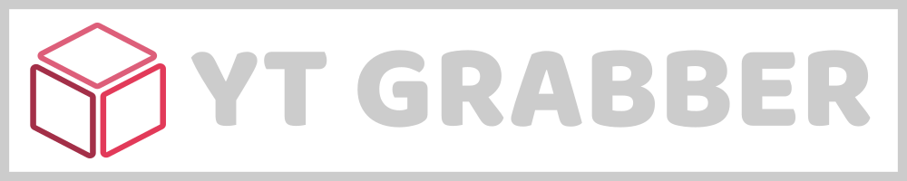
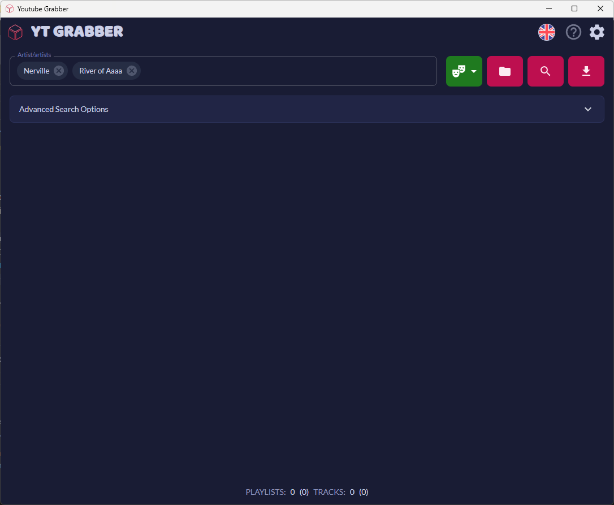
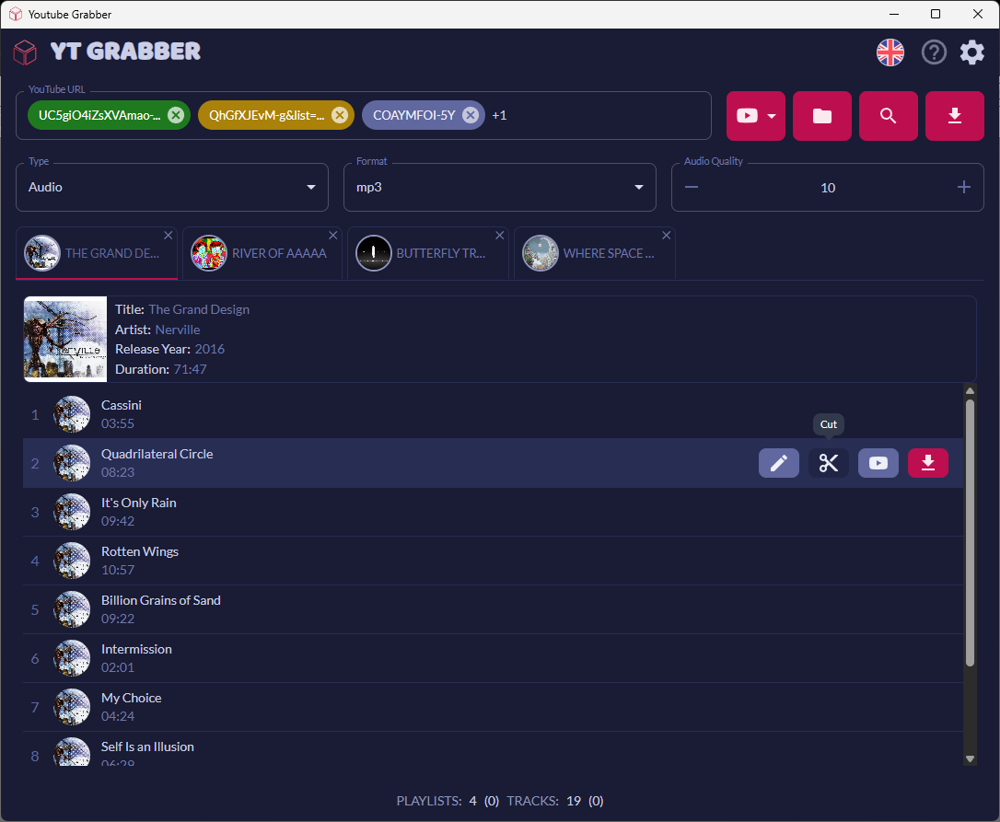
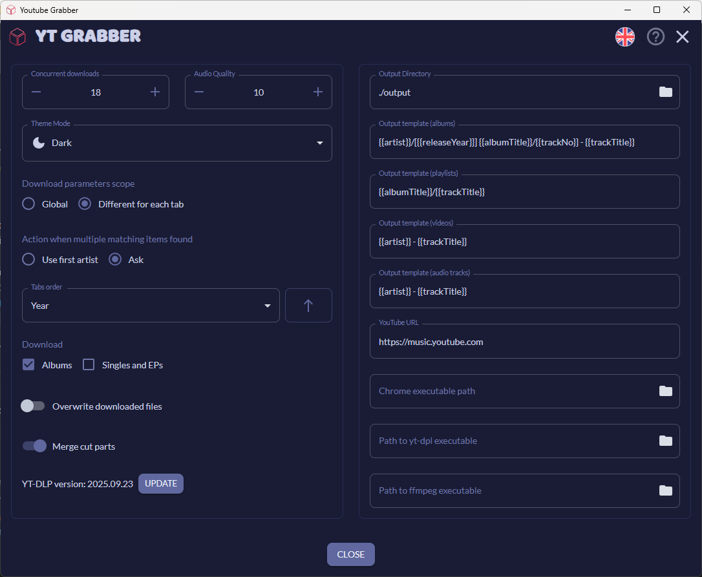

---

**YT Grabber** is a robust desktop application designed to retrieve multimedia from YouTube and YouTube Music services.

It provides responsive UI to manage your downloads and automation features improve and accelerate download process.

It provides support for downloading:

-   videos
-   audio tracks
-   complete playlists
-   full discographies

Various formats and quality options are available for both - audio and video.

Each download can be customized to your needs for easy workflow automation.

## Table of Contents

- [Table of Contents](#table-of-contents)
- [Features](#features)
- [Screenshots](#screenshots)
- [Usage](#usage)
- [Development](#development)
- [Running](#running)
- [Packaging](#packaging)
- [License](#license)
- [Legal Disclaimer](#legal-disclaimer)

## Features

* Download video, audio, playlists and complete artist discographies

* Multiple output formats (mp3, m4u, flac, wav, mp4, mkv)

* Customizable audio and video quality

* Trimming video and audio

* Batch multimedia download

* Metadata (tags) embedding

* Configurable output

* Multiple language support (English, German, Polish out of the box)

* Light/Dark theme

* Responsive and clean UI

## Screenshots

*Main window*

*Displaying multimedia info*

*Downloading multimedia*

*Settings*

## Usage

Download and run latest release installer from [here](https://github.com/karenpommeroy/yt-grabber/releases).

## Development

To build **yt-grabber** follow these steps:

1. Clone this repository
2. Install dependencies using `npm install` or `yarn install` command
3. If using `yarn` with Visual Studio Code also run `yarn dlx @yarnpkg/sdks vscode`
4. Run `npm build` or `yarn build` command to build

## Running

Run `npm start` or `yarn start` to run the app for development.
This will start webpack development server that will watch for changes to source code and reload the application automatically.

## Packaging

To prepare release application package run `npm dist` or `yarn dist` command.

## License

This project is licensed under the [MIT License](LICENSE).

## Legal Disclaimer

All music files downloaded through this software must be legally owned and purchased by the user. By downloading music via this software, you represent that you have purchased and fully own the rights to any downloaded content or an active subscription to YouTube Music. Downloading or distributing pirated or illegal music copies is strictly prohibited. I claim no ownership rights to any downloaded music files - all such rights remain with the content owner. I accept no liability for the illegal use of any files downloaded through this software.
